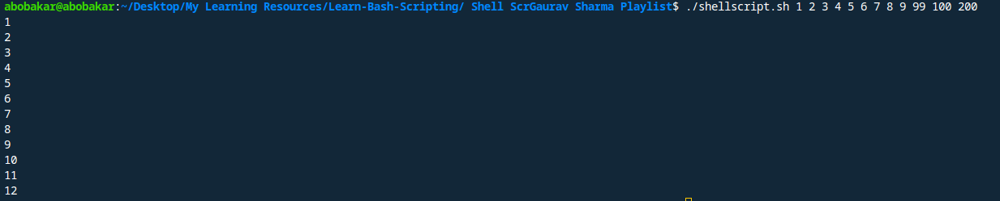

# Command line Argument 

```
 echo $1
 echo $2
 echo $3
 echo $4
 echo $5
 echo $6
 echo $7
 echo $8
 echo $9
 echo $10
 echo $11
 echo $12
```
## output


 
 ```
 ./shellscript 1 2 3 4 5 6 6 7 8 9 100 200 300

1
2
3
4
5
6
7
8
9
10
11
12
 ```
# Best to Use {} for show variable value
use {} bracket because when we use $11 only $1 value shows and 1 concrete the $1 value.

```
 echo ${1}
 echo ${2}
 echo ${3}
 echo ${4}
 echo ${5}
 echo ${6}
 echo ${7}
 echo ${8}
 echo ${9}
 echo ${10}
 echo ${11}
 echo ${12}
```

## output
```
./shellscript.sh 1 2 3 4 5 6 7 8 9 100 200 300

1
2
3
4
5
6
7
8
9
100
200
300
```